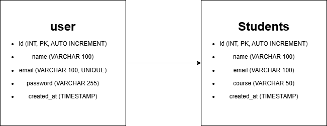

# Internship Project
This is my Web Application Development Internship Project.

Below is the ER diagram for the Users and Students tables.

| Column     | Type                     | Description     |
| ---------- | ------------------------ | --------------- |
| id         | INT (PK, AUTO_INCREMENT) | Unique user ID  |
| name       | VARCHAR(100)             | Full name       |
| email      | VARCHAR(100)             | Login email     |
| password   | VARCHAR(255)             | Hashed password |
| created_at | TIMESTAMP                | Auto timestamp  |

| Column     | Type                     | Description    |
| ---------- | ------------------------ | -------------- |
| id         | INT (PK, AUTO_INCREMENT) | Unique ID      |
| name       | VARCHAR(100)             | Student name   |
| email      | VARCHAR(100)             | Student email  |
| course     | VARCHAR(50)              | Course name    |
| created_at | TIMESTAMP                | Auto timestamp |

